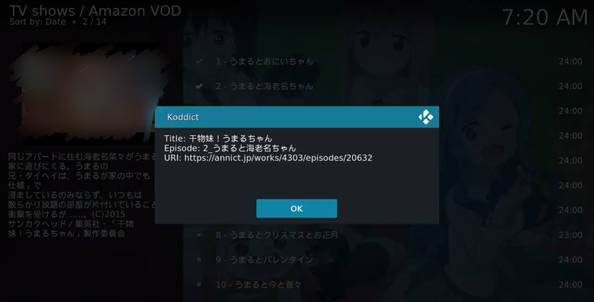

# xbmc-koddict
Kodi で Amazon Prime Video 上のアニメを見たとき、ボタン1つで Annict 視聴記録

## 確認環境
- Arch Linux (64bit)、Kodi 18.0-RC5
- Windows 10 (64bit)、Kodi 18.0-RC5

- Amazon のプライム会員である
- Annict のユーザである
- Annict の個人用アクセストークンを持っている [このページを参照して取得してください](http://blog.annict.com/post/157138114218/personal-access-token)
このとき、読み込み、書き込み権限両方与えてください。

(注1) このページだけを見て Kodi をインストールしないでください。情報が圧倒的に少ないです。どのサイトでも書かれているかと思いますがフォント (Fonts) は「Arial based」にしてください。豆腐の地獄に陥ります。
(注2) Kodi は (H30 1/28 時点で安定版はバージョン17ですが) バージョン18のほうが良いです。機能的な (Inputstream 関係) 理由です。詳しくは[ここ](https://forum.kodi.tv/showthread.php?tid=331136)
(注3) Fire TV Stick にインストールした Kodi で実現しようとしましたが、後述のプラグインの導入がまず無理でした。文字コード関係だと思います。Fire OS ≒ Android という意味で Android 版の Kodi ではできないと思われます。

## 導入方法
1. まずは [ Amazon Prime Video を見られるようにするアドオン](https://github.com/Sandmann79/xbmc)を Kodi にインストール
xbmc/packages/repository.sandmann79.plugins/*.zip をインストール、このアドオンはリポジトリからインストールするのが楽だと思います

2. ログイン設定等して、Amazon Prime Video を見られるようにしてください。
General -> Playback with は Input Stream が一番快適に使えます。
Connection -> Region は Japan で、Sign In… から自分の Amazon アカウントを入力
次の手順に進む前に適当なビデオを再生できることを確認してください。初回は他のアドオンのインストールも行われるはずです。許可してください。
3. 次に本アドオンをダウンロード (git clone してファイル取り出す、ブラウザからのダウンロード、wget……)
4. 環境変数 (ANNICT_TOKEN) を設定、もしくは addon.py と同じディレクトリに「ANNICT_TOKEN」ファイルを作成、1行目にトークンを入力してください。
5. 本アドオンをインストール、コンテキストメニュー (右クリック or キーボードで「C」押下で開きます) に「Koddict」が現れるはずです
6. ビデオアドオンから Amazon VOD を開き、アニメを見たら Koddict で Annict へ視聴記録ができます。
(バグは多いです。きちんと Annict へ記録できたか確認することをおすすめします。
Annict 視聴記録と Twitter 投稿を同時にしたい方は addon.py を開いて「"share_twitter": "false",」の行を「"share_twitter": "true",」に変えてください。後々、設定できるようにします (予定))

